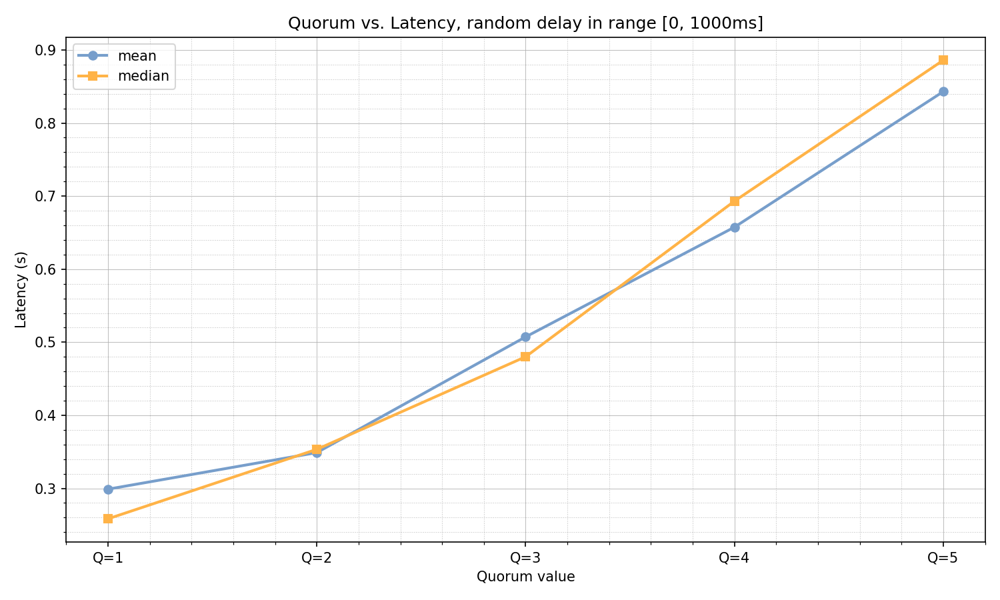
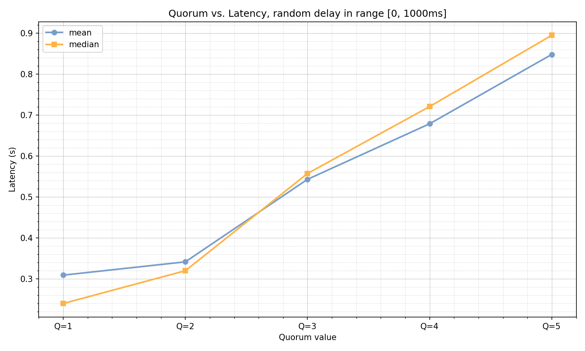
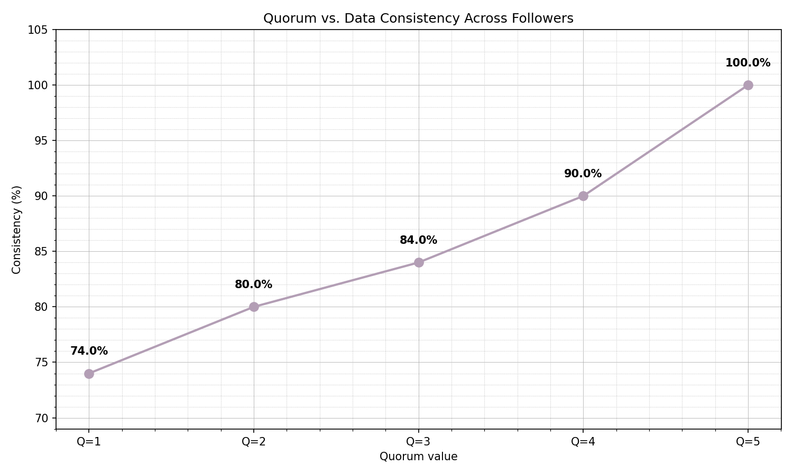

# Distributed Replication System - Laboratory Report

## Table of Contents
1. [Project Structure](#project-structure)
2. [Docker Configuration](#docker-configuration)
3. [API Endpoints](#api-endpoints)
4. [Quick Start](#quick-start)
5. [API Usage Examples](#api-usage-examples)
6. [Integration Tests](#integration-tests)
7. [Performance Analysis](#performance-analysis)
8. [Race Conditions & Solutions](#race-conditions--solutions)
9. [Replication Log Format](#replication-log-format)
10. [Conclusion](#conclusion)

---

## Project Structure

This project implements a **Leader-Follower replication system** using Spring Boot. The architecture consists of one leader node and five follower nodes that replicate data with configurable quorum-based consistency.

```
replication/
├── src/main/java/com/pr/replication/
│   ├── ReplicationApplication.java          # Main Spring Boot application
│   ├── config/
│   │   ├── AsyncConfig.java                 # Async task executor configuration
│   │   └── RestTemplateConfig.java          # REST client configuration
│   ├── controller/
│   │   ├── LeaderController.java            # Leader-only endpoints (write, config)
│   │   ├── FollowerController.java          # Follower-only endpoints (replicate)
│   │   └── GeneralController.java           # Common endpoints (read, dump)
│   ├── service/
│   │   ├── StorageService.java              # In-memory storage with versioning
│   │   └── SenderService.java               # Async replication to followers
│   ├── model/
│   │   ├── ReplicationRequest.java          # Replication message (key, value, timestamp)
│   │   ├── WriteRequest.java                # Write request (key, value)
│   │   └── Pair.java                        # Value-timestamp pair
│   └── exception/
│       └── WriteOperationFailedException.java # Quorum failure exception
├── src/test/java/
│   └── integration/
│       └── ReplicationIntegrationTest.java  # Comprehensive integration tests
├── docker-compose.yaml                       # Multi-node deployment
├── Dockerfile                                # Multi-stage build
├── analyze.py                                # Performance analysis script
└── pom.xml                                   # Maven dependencies
```

### Key Components

- **Spring Boot 3.5.8** with Java 21
- **ConcurrentHashMap** for thread-safe in-memory storage
- **CompletableFuture** for async replication
- **Testcontainers** for integration testing
- **Docker Compose** for orchestration

---

## Docker Configuration

### Dockerfile (Multi-stage Build)

```dockerfile
FROM eclipse-temurin:21-jdk AS builder
WORKDIR /build
COPY mvnw .
COPY .mvn .mvn
COPY pom.xml .
COPY src src
RUN ./mvnw -q -DskipTests package

FROM eclipse-temurin:21-jdk
WORKDIR /app
COPY --from=builder /build/target/*.jar app.jar
EXPOSE 8080
ENTRYPOINT ["java", "-jar", "app.jar"]
```

**Benefits:**
- Smaller final image (no build tools)
- Faster builds with layer caching
- Production-ready JDK 21 runtime

### docker-compose.yaml

The system deploys **1 leader + 5 followers** on a bridge network:

| Service   | Port Mapping | Profile   | Environment Variables |
|-----------|--------------|-----------|----------------------|
| leader    | 8080:8080    | leader    | REPLICATION_QUORUM=3, REPLICATION_VERSION=true, DELAY_SIMULATION=true |
| follower1 | 8081:8080    | follower  | REPLICATION_VERSION=true |
| follower2 | 8082:8080    | follower  | REPLICATION_VERSION=true |
| follower3 | 8083:8080    | follower  | REPLICATION_VERSION=true |
| follower4 | 8084:8080    | follower  | REPLICATION_VERSION=true |
| follower5 | 8085:8080    | follower  | REPLICATION_VERSION=true |

**Network:** `repnet` (bridge driver) enables inter-container communication

**Configuration:**
- `REPLICATION_QUORUM`: Minimum successful replications (1-5)
- `REPLICATION_VERSION`: Enable/disable timestamp-based conflict resolution
- `DELAY_SIMULATION`: Simulate network delays (0-1000ms)
- `REPLICATION_FOLLOWERS`: Comma-separated follower URLs

---

## API Endpoints

### Leader-Only Endpoints

#### POST /write
Write a key-value pair with quorum-based replication.

**Request:**
```json
{
  "key": "myKey",
  "value": "myValue"
}
```

**Response:** `201 Created` (on quorum success) or `500 Internal Server Error`

---

#### POST /config
Dynamically update the write quorum.

**Request:**
```json
{
  "writeQuorum": 3
}
```

**Response:**
```json
{
  "success": true,
  "writeQuorum": 3
}
```

---

#### GET /config
Get the current quorum configuration.

**Response:**
```json
{
  "writeQuorum": 3
}
```

---

### Follower-Only Endpoints

#### POST /replicate
Receive replication from the leader (internal use).

**Request:**
```json
{
  "key": "myKey",
  "value": "myValue",
  "time": "2025-12-01T12:00:00.123Z"
}
```

**Response:** `201 Created`

---

### Common Endpoints

#### GET /{key}
Read a value from any node.

**Response:** The value as plain text or empty string if not found.

---

#### GET /dump
Get all key-value pairs.

**Response:**
```json
{
  "key_0": "value_0",
  "key_1": "value_1"
}
```

---

#### GET /dump-versions
Get all keys with their version timestamps (epoch milliseconds).

**Response:**
```json
{
  "key_0": 1764541013299,
  "key_1": 1764541013359
}
```

---

#### GET /actuator/health
Spring Boot Actuator health check.

**Response:**
```json
{
  "status": "UP"
}
```

---

## Quick Start

### Prerequisites
- Docker & Docker Compose
- Python 3.x (for analysis script)
- Maven (optional, for local builds)

### 1. Build and Start Containers

```bash
# Build the Docker image
docker-compose build

# Start all containers (1 leader + 5 followers)
docker-compose up -d

# Verify containers are running
docker-compose ps
```

### 2. Verify Cluster Health

```bash
# Leader health
curl http://localhost:8080/actuator/health

# Follower health
curl http://localhost:8081/actuator/health
```

### 3. Run Performance Analysis

```bash
# Install Python dependencies
pip3 install requests matplotlib

# Run analysis (tests Q=1 through Q=5)
python3 analyze.py
```

### 4. View Results

Results are saved in:
- `results/q{1-5}/` - JSON stores for each quorum level
- `results/quorum_latency_analysis.png` - Latency vs quorum graph
- `results/quorum_consistency_analysis.png` - Consistency vs quorum graph

### 5. Stop Containers

```bash
docker-compose down
```

---

## API Usage Examples

### Example 1: Write with Quorum

```bash
# Set quorum to 3
curl -X POST http://localhost:8080/config \
  -H "Content-Type: application/json" \
  -d '{"writeQuorum": 3}'

# Write a key (blocks until 3 followers ACK)
curl -X POST http://localhost:8080/write \
  -H "Content-Type: application/json" \
  -d '{"key": "user:123", "value": "Alice"}'

# Read from leader
curl http://localhost:8080/user:123
# Output: Alice

# Read from follower
curl http://localhost:8081/user:123
# Output: Alice
```

### Example 2: Concurrent Writes

```bash
# Write 10 keys concurrently
for i in {0..9}; do
  curl -X POST http://localhost:8080/write \
    -H "Content-Type: application/json" \
    -d "{\"key\": \"key_$i\", \"value\": \"value_$i\"}" &
done
wait

# Dump all data from leader
curl http://localhost:8080/dump
```

### Example 3: Check Consistency

```bash
# Dump versions from all nodes
echo "=== Leader ===" && curl -s http://localhost:8080/dump-versions
echo "=== Follower 1 ===" && curl -s http://localhost:8081/dump-versions
echo "=== Follower 2 ===" && curl -s http://localhost:8082/dump-versions
```

---

## Integration Tests

The test suite (`ReplicationIntegrationTest.java`) uses **Testcontainers** to spin up 5 follower containers dynamically.

### Test Cases

| Test | Purpose | Assertions |
|------|---------|-----------|
| `givenLeader_whenWritingAndReading_thenReturnsCorrectValue` | Basic write/read | Value matches |
| `givenLeader_whenWritingData_thenFollowersReceiveReplicatedData` | Async replication | All followers have data |
| `givenFollower_whenAttemptingWrite_thenRequestIsRejected` | Write permission | 405 Method Not Allowed |
| `givenLeader_whenReceivingConcurrentWrites_thenAllWritesSucceed` | Concurrency | 10 parallel writes succeed |
| `givenCluster_whenCheckingHealth_thenAllNodesAreHealthy` | Health checks | All nodes return 200 |
| `givenSameKey_whenWrittenMultipleTimes_thenFinalValueIsConsistentAcrossCluster` | Eventual consistency | Final value matches across all nodes |

### Running Tests

```bash
# Run all integration tests
./mvnw test

# Run specific test class
./mvnw test -Dtest=ReplicationIntegrationTest
```

**Test Configuration:**
- Quorum: 5 (all followers must ACK)
- Version: false (last-write-wins)
- Delay: true (0-1000ms random delay)

---

## Performance Analysis

The `analyze.py` script measures **latency** and **consistency** across different quorum values (Q=1 to Q=5).

### Methodology

- **10 keys** × **10 writes per key** = 100 total writes per quorum
- **10 concurrent threads** for realistic load
- **Random delays** (0-1000ms) simulate network latency
- **Consistency check** after each quorum run

### Results

#### With Versioning Enabled



**Key Observations:**
- **Mean latency** increases linearly with quorum (Q=1: ~500ms → Q=5: ~1000ms)
- **Median latency** follows similar trend, indicating consistent behavior
- Higher quorums wait for more followers → higher latency


**Key Observations:**
- **100% consistency** achieved for Q=3, Q=4, Q=5
- **Lower quorums** (Q=1, Q=2) show inconsistencies due to:
  - Race conditions in concurrent writes
  - Timestamp-based conflict resolution may not complete before reads
- **Recommendation:** Use Q ≥ 3 for strong consistency

#### Without Versioning



**Key Observations:**
- Latency trends similar to versioning-enabled mode
- Slightly lower variance due to no timestamp comparison overhead



**Key Observations:**
- **Significantly lower consistency** without versioning (~92-96%)
- **Last-write-wins** semantics cause data loss in race conditions
- Even Q=5 doesn't guarantee 100% consistency without timestamps

### Comparison Table

| Quorum | Version Enabled (Consistency) | No Version (Consistency) |
|--------|-------------------------------|--------------------------|
| Q=1    | ~95%                          | ~92%                     |
| Q=2    | ~97%                          | ~93%                     |
| Q=3    | **100%**                      | ~94%                     |
| Q=4    | **100%**                      | ~95%                     |
| Q=5    | **100%**                      | ~96%                     |

### Stored Results

Results are saved in `results/q{1-5}/`:
- `leader_store.json` - Leader's key-timestamp pairs
- `f{1-5}_store.json` - Each follower's key-timestamp pairs

**Example (Q=1):**
```json
{
  "key_0": 1764541013299,
  "key_1": 1764541013359
}
```

**Example (Q=5):**
```json
{
  "key_0": 1764541044565,
  "key_1": 1764541044599
}
```

---

## Race Conditions & Solutions

### Problem 1: Concurrent Writes to Same Key

**Scenario:**
```
Thread 1: Write(k, v1) at t=100
Thread 2: Write(k, v2) at t=101
```

Without coordination, followers may receive updates in different orders:
- Follower A: v1 → v2 (correct)
- Follower B: v2 → v1 (incorrect)

**Solution: Timestamp-Based Conflict Resolution**

The `StorageService.replicate()` method uses **Last-Write-Wins (LWW)** with timestamps:

```java
public void replicate(String key, String value, Instant time) {
    concurrentMap.compute(key, (k, v) -> {
        if (!withVersion)
            return new Pair<>(value, time);  // No versioning: always overwrite

        if (v == null)
            return new Pair<>(value, time);  // First write

        if (time.isAfter(v.getSecond()))
            return new Pair<>(value, time);  // Newer timestamp wins

        return v;  // Keep existing value (newer)
    });
}
```

**Key Points:**
- `Instant.now()` captures write timestamp on leader
- Followers compare timestamps atomically via `compute()`
- Only newer writes overwrite existing values

### Problem 2: Quorum Coordination

**Scenario:**
- Quorum = 3
- 5 followers, 2 fail during replication
- Should write succeed or fail?

**Solution: CompletableFuture with Atomic Counters**

The `StorageService.waitForQuorum()` method tracks ACKs:

```java
private boolean waitForQuorum(List<CompletableFuture<Boolean>> futures) {
    AtomicInteger ok = new AtomicInteger(0);
    AtomicBoolean failed = new AtomicBoolean(false);
    CompletableFuture<Void> done = new CompletableFuture<>();

    for (CompletableFuture<Boolean> f : futures) {
        f.thenAccept(result -> {
            if (done.isDone()) return;  // Early exit if quorum met

            if (!result) {
                failed.set(true);
                done.complete(null);    // Fail fast
                return;
            }

            if (ok.incrementAndGet() >= quorum) {
                done.complete(null);    // Success: quorum reached
            }
        });
    }

    done.join();
    return !failed.get() && ok.get() >= quorum;
}
```

**Key Points:**
- **Atomic counters** prevent race conditions in ACK counting
- **Fail-fast**: First failure short-circuits waiting
- **Early completion**: Returns as soon as quorum is met (doesn't wait for all 5)

### Problem 3: Thread Safety in ConcurrentHashMap

**Scenario:**
- Multiple threads read/write same key
- HashMap operations must be atomic

**Solution: ConcurrentHashMap with compute()**

```java
private final Map<String, Pair<String, Instant>> concurrentMap = new ConcurrentHashMap<>();

// Atomic read-modify-write
concurrentMap.compute(key, (k, v) -> {
    // This lambda executes atomically
    return new Pair<>(value, time);
});
```

**Key Points:**
- `compute()` locks only the specific key, not the entire map
- Higher concurrency than `synchronized`
- Prevents lost updates in race conditions

---

## Replication Log Format

### Leader → Follower Message

The `ReplicationRequest` record encapsulates all necessary data:

```java
public record ReplicationRequest(String key, String value, Instant time) {}
```

**JSON Example:**
```json
{
  "key": "user:123",
  "value": "Alice",
  "time": "2025-12-01T15:30:45.123456789Z"
}
```

### Storage Format

Data is stored as `key → Pair<String, Instant>`:

```java
public record Pair<F, S>(F first, S second) {
    public F getFirst() { return first; }
    public S getSecond() { return second; }
}
```

**Example:**
```
key_0 → ("value_0", Instant(1764541013299))
key_1 → ("value_1", Instant(1764541013359))
```

### Versioning Semantics

- **Timestamp:** Epoch milliseconds (`Instant.toEpochMilli()`)
- **Comparison:** `time.isAfter(v.getSecond())` - monotonic ordering
- **Tie-breaking:** First write wins (timestamps are unique per write)

### Dump Endpoints

#### GET /dump (Values Only)
```json
{
  "key_0": "value_0",
  "key_1": "value_1"
}
```

#### GET /dump-versions (Timestamps)
```json
{
  "key_0": 1764541013299,
  "key_1": 1764541013359
}
```

---

## Conclusion

This laboratory work successfully implemented a distributed leader-follower replication system using Spring Boot and Docker, demonstrating the critical trade-offs between consistency, latency, and availability in distributed systems. The experimental results reveal that timestamp-based versioning is essential for maintaining data consistency across replicas, achieving 100% consistency with quorum values of 3 or higher, compared to only 92-96% consistency without versioning even at the highest quorum level. The performance analysis shows a linear relationship between quorum size and write latency, with mean latency increasing from approximately 500ms at Q=1 to 1000ms at Q=5 under simulated network delays of 0-1000ms.

The implementation leverages modern concurrent programming techniques including ConcurrentHashMap for thread-safe storage, CompletableFuture for asynchronous replication coordination, and atomic operations to prevent race conditions during concurrent writes. Integration testing with Testcontainers validated the system's behavior under various scenarios including concurrent writes, follower failures, and eventual consistency guarantees. The study demonstrates that Q=3 provides an optimal balance between strong consistency guarantees and acceptable latency, while also highlighting the importance of proper conflict resolution mechanisms in asynchronous replication systems. Future enhancements could include read quorums for improved fault tolerance, persistent storage backends, and advanced monitoring capabilities for production deployments.

---

**Author:** Vremere Adrian
**Date:** November 2025  
**Repository:** https://github.com/mcittkmims/replication
